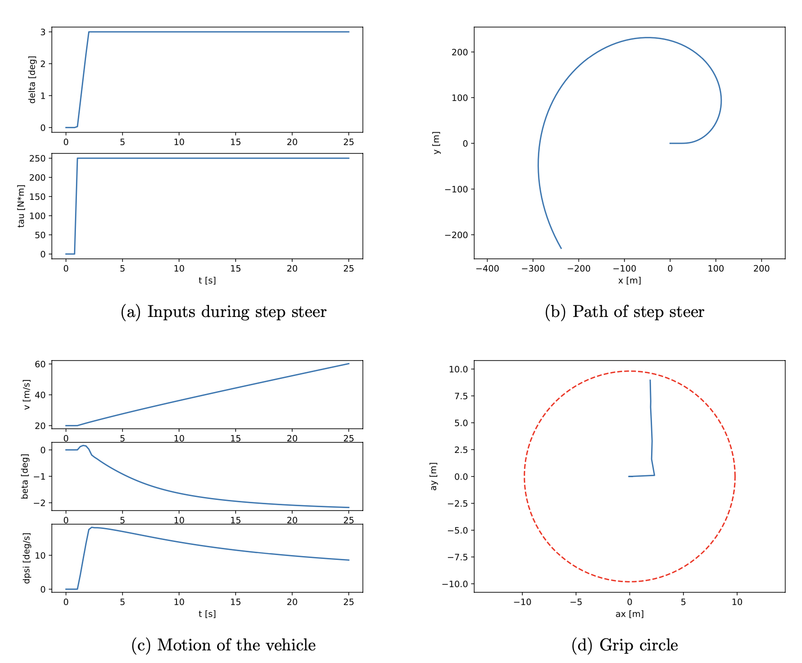

# me334-veh-dyn

Simulation of a 6DOF vehicle handling model. The vehicle is free to translate and yaw in the 2D plane. The vehicle chassis is modeled as four point masses at ground level representing each unsprung corner. The vehicle body is connected to the chassis at a single pivot point. This body is free to pitch, roll and heave relative to the chassis, and it is also coupled to each corner via a spring and damper in parallel. The nonlinear tire behavior is captured using the Fiala tire model. See the [writeup](final_report.pdf) for more details.

